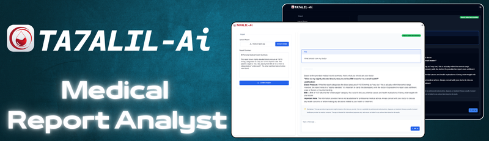

# TA7ALIL Ai

<div align="center">


<div>


</div>

**AI-Powered Medical Report Analysis**

</div>

ta7alil AI is an advanced healthcare application that leverages artificial intelligence to analyze medical reports. Built with cutting-edge technologies, it provides healthcare professionals with quick and accurate insights from medical documents.

## 🖥️ Tech Stack

- **Next.js**: React framework for building the user interface
- **Pinecone**: Vector database for efficient document retrieval
- **Gemini AI**: Google's AI model for natural language processing
- **mixedbread-ai/mxbai-embed-large-v1**: Hugging Face model for text embeddings
- **Tailwind CSS**: Utility-first CSS framework for styling
- **Vercel**: Platform for frontend deployment and hosting

## 📋 Features

- **AI-Powered Analysis**: Utilizes Gemini AI to interpret and analyze medical reports
- **Vector Search**: Implements Pinecone for fast and accurate document retrieval
- **Advanced Embeddings**: Uses mixedbread-ai/mxbai-embed-large-v1 for high-quality text representations
- **Responsive Design**: Ensures a seamless experience across all device sizes
- **Real-time Processing**: Provides quick results for efficient workflow

## 🚀 Quick Start

### Prerequisites

Ensure you have the following installed:

- Git
- Node.js
- npm

### Installation Steps

1. Clone the repository:

   ```bash
   git clone https://github.com/yourusername/ta7alil-ai.git
   cd ta7alil-ai
   ```

2. Install dependencies:

   ```bash
   npm install
   ```

3. Set up environment variables:
   Create a `.env.local` file in the root directory with the following content:

   ```
   GEMINI_API_KEY=YOUR_GEMINI_API_KEY
   PINECONE_API_KEY=YOUR_PINECONE_API_KEY
   HUGGINGFACE_TOKEN=YOUR_HUGGINGFACE_TOKEN
   ```

4. Run the development server:

   ```bash
   npm run dev
   ```

5. Open [http://localhost:3000](http://localhost:3000) in your browser to view the app.

## 📝 Usage

1. Upload a medical report through the user interface.
2. The system will process the document using Gemini AI and the Hugging Face model.
3. View the analysis results and insights provided by the AI.

## 🔒 Security Note

Please ensure that you handle medical data in compliance with relevant healthcare regulations and data protection laws.

## 🤝 Contributing

Contributions, issues, and feature requests are welcome! Feel free to check [issues page](https://github.com/yourusername/ta7alil-ai/issues).

## 📄 License

This project is [MIT](https://choosealicense.com/licenses/mit/) licensed.

## 📱 Contact

If you have any questions or issues, please open an issue on the GitHub repository.

---

Built with ❤️ by Oclaz
